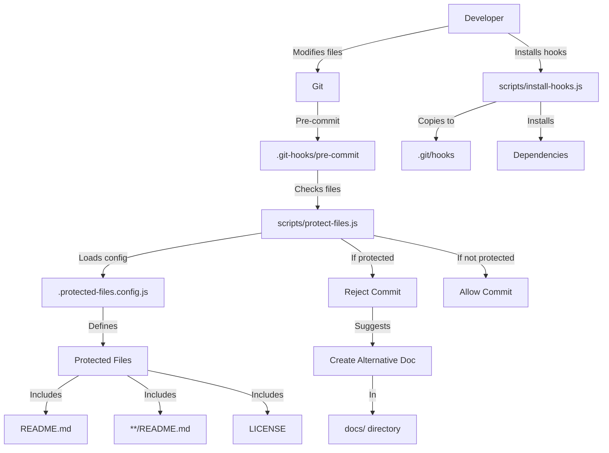
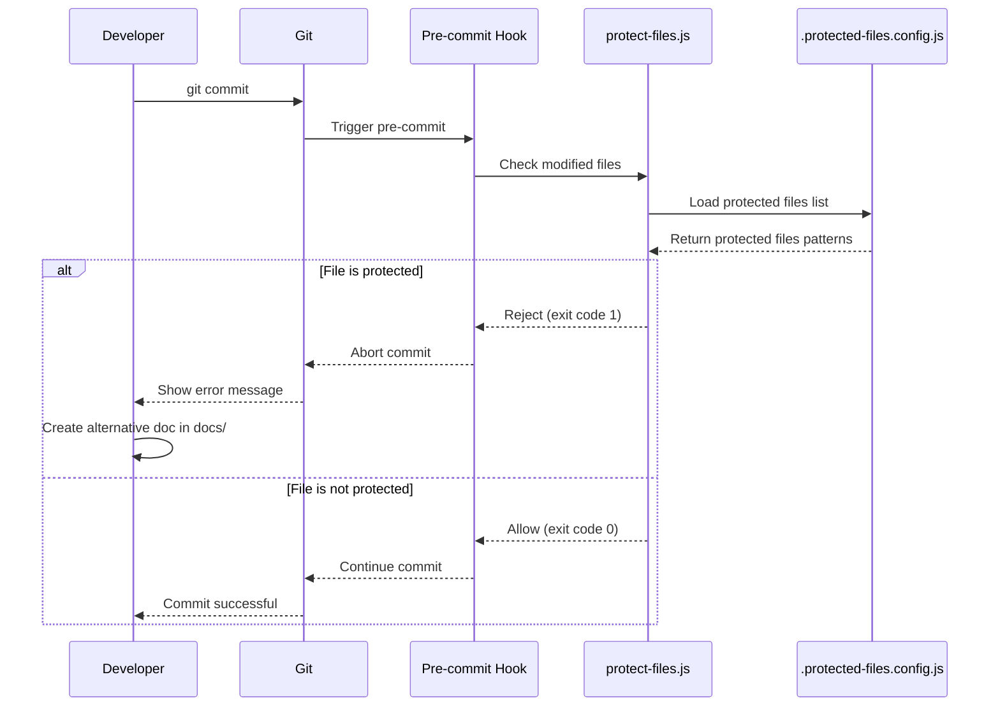
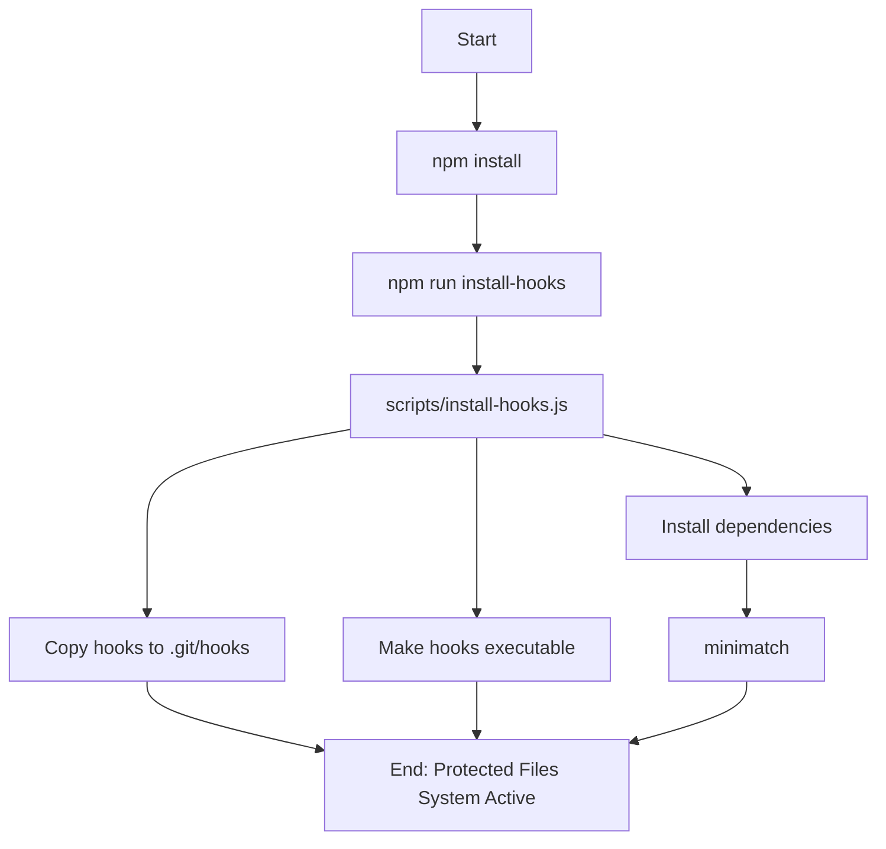
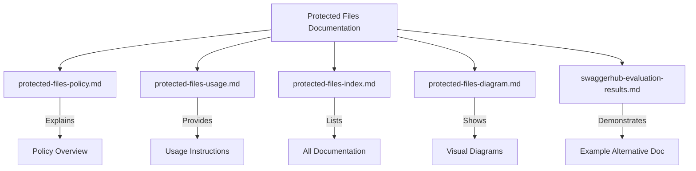

# Protected Files System - Visual Diagram

This document provides a visual representation of the protected files system architecture and workflow.

## System Architecture



## Workflow



## Installation Process



## Documentation Structure



## Testing Process

```mermaid
flowchart TD
    A[Start Test] --> B[npm test]
    B --> C[scripts/test-protection.js]
    
    C --> D{Test 1: Check Protected File}
    D -->|Should Fail| E[Verify Error]
    
    C --> F{Test 2: Check Unprotected File}
    F -->|Should Pass| G[Verify Success]
    
    C --> H{Test 3: Commit Protected File}
    H -->|Should Fail| I[Verify Hook Blocks]
    
    C --> J{Test 4: Commit Unprotected File}
    J -->|Should Pass| K[Verify Hook Allows]
    
    E --> L[All Tests Passed?]
    G --> L
    I --> L
    K --> L
    
    L -->|Yes| M[System Working Correctly]
    L -->|No| N[Fix Issues]
    N --> A
